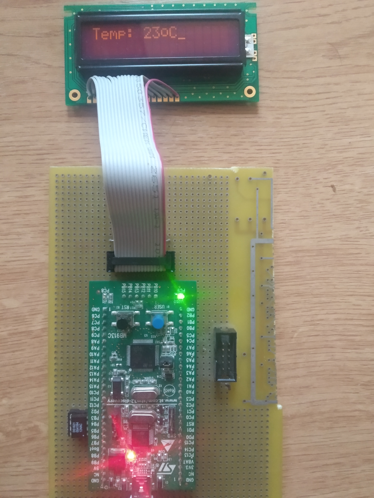

# Description
This bare-metal micro-project is based on STM32VLDISCOVERY board. It implements temperature measurement by DS1621 sensor chip and showing
result value on 1602 LCD display. 

## Libraries
Microcontroller peripheral interactions rely on [libopencm3](https://github.com/libopencm3/libopencm3) opensource library 
for ARM Cortex-M based microcontrollers. 

## Building
For code compiling and linking [arm-none-eabi-gcc](https://developer.arm.com/tools-and-software/open-source-software/developer-tools/gnu-toolchain/gnu-rm/downloads) was used. 
See Makefile.

## Flashing
I use [stlink](https://github.com/stlink-org/stlink) programmer to flash binaries into the chip. It is good working and easy to use. 

## Device photo

